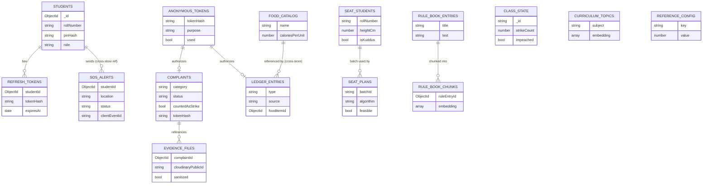
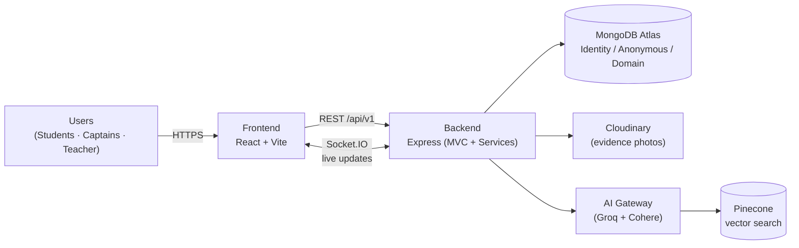

# Anti-Kuddus Protocol

A full-stack web application built for the BAIUST Computer Club Hackathon 2026, based on the problem statement "The Fall of Kodu Kuddus".

The system enables the general students of Class 7, Section B to anonymously document the misconduct of the 1st Captain (Kodu Kuddus), protect whistleblower identities, coordinate real-time SOS alerts with the 2nd and 3rd Captains (Biltu and Miltu), and deliver the three validated strikes required for impeachment to the class teacher (Rashid Sir).

## Table of Contents

- [Features](#features)
- [Technology Stack](#technology-stack)
- [Architecture](#architecture)
- [Architectural Trade-offs](#architectural-trade-offs)
- [Local Setup](#local-setup)
- [Environment Variables](#environment-variables)
- [Database Seeding](#database-seeding)
- [Running Tests](#running-tests)
- [Login Credentials (Seeded Roster)](#login-credentials-seeded-roster)
- [API Overview](#api-overview)
- [Full API Endpoint Reference](#full-api-endpoint-reference)
- [Database Diagram](#database-diagram)
- [System Architecture Diagram](#system-architecture-diagram)
- [Roles and Access Control](#roles-and-access-control)
- [Screenshots](#screenshots)
- [Deployment](#deployment)
- [Project Structure](#project-structure)

## Features

The application implements all six hackathon missions, including the advanced engineering requirements.

### Mission 1: The Anonymous Whistleblower (Strike Generator)

- Secure login using a secret class roll-number mapping with JWT access and refresh tokens.
- Anonymous complaint submission form with categories (Tiffin Theft, Bribes, Syllabus Bloat, etc.) and text descriptions.
- Central dashboard with a dynamic progress bar showing "Warnings: X/3 — Strikes left until Impeachment".
- Absolute Anonymity Pipeline: complaints are stored against unlinkable one-way anonymous tokens in a physically separate database, so roll numbers cannot be reverse-engineered even if the database is leaked or accessed by Kuddus.
- Evidence Metadata Stripping: photo evidence uploads are re-encoded server-side (Sharp) to remove all EXIF metadata (timestamps, GPS, camera signatures) before storage in Cloudinary.

### Mission 2: The Anti-Camouflage Seat Planner

- Input interface for student records (Name, Roll Number, Height in cm).
- Interactive N x M classroom grid UI representing desks.
- Baseline height-ascending sort from front row to back row.
- Line-of-Sight Optimization Algorithm: computes desk positions guaranteeing the teacher an unobstructed view of Kuddus's desk, accounting for the teacher's position and the heights of students seated in front.
- Dynamic constraint handling: students with vision or hearing impairments are always placed in the front rows, and physical classroom constraints such as center aisles are respected.

### Mission 3: The Syllabus Negotiator (AI Integration)

- Input field for pasting long-form syllabus announcements.
- LLM-based summarization into a clean bulleted list of topics (Groq chat completions API).
- Contextual RAG: official textbook chapter structures are embedded (Cohere) and indexed in Pinecone; the syllabus is cross-referenced against the curriculum to filter out non-examinable content.
- Smart Study Plan Generator: produces a structured, time-blocked JSON study schedule counting down to the test day, generated via a structured-output model chain with configurable weighting constants.

### Mission 4: The Corrupt Economy and Tiffin Ledger

- Anonymous digital ledger for logging forced payments (2-Taka washroom toll) and stolen food items.
- Data visualization (Recharts) of total cash extorted and food items collected over time.
- Caloric vs. Kinetic Disparity Engine: models Kuddus's estimated caloric intake from the stolen-food catalog against his energy expenditure.
- Projected Weaponry Conversions: converts total extorted cash in real time into equivalent cricket bats and packets of premium jhalmuri.

### Mission 5: The SOS Rescue Flare

- Prominent, mobile-friendly SOS button with a hardcoded location dropdown (Library, Playground, Corridor, Classroom, Canteen).
- Live captain dashboard for the 2nd and 3rd Captains showing active distress signals.
- Real-Time Event Broadcast: Socket.IO delivers alerts to the captains' screens within milliseconds, without page refreshes.
- Network Resilience: SOS alerts triggered while offline are cached client-side and automatically synced to the server when connectivity is restored.

### Mission 6: The Kuddus Fact-Checker

- Search interface for claims made by Kuddus.
- Baseline string-matching search against a pre-seeded database of official school guidelines.
- Semantic Fact-Checking Engine: embedding-based semantic search over the unstructured Official School Rulebook.
- Validation card output with a definitive TRUE/FALSE status, a confidence score, and an exact quote of the real rule.

## Technology Stack

| Layer | Technologies |
|---|---|
| Frontend | React 19, Vite, Tailwind CSS 4, React Router 7, Redux Toolkit, Axios, React Hook Form, Recharts, Framer Motion, socket.io-client |
| Backend | Node.js, Express 5, Mongoose 9, Socket.IO, JSON Web Tokens, Bcrypt, Multer, Sharp, express-validator, express-rate-limit, Helmet |
| AI / RAG | OpenAI SDK (Groq-compatible endpoint), LangChain, Cohere embeddings, Pinecone vector database |
| Database | MongoDB Atlas (three logical databases on one cluster) |
| File Storage | Cloudinary |
| Testing | Vitest, Supertest, mongodb-memory-server, React Testing Library |

## Architecture

### High-Level Overview

```
+----------------+      REST (Axios, /api/v1)       +---------------------------+
|    Frontend    | <------------------------------> |          Backend          |
|  React + Vite  |      Socket.IO (SOS alerts)      |  Express (MVC + Services) |
+----------------+                                  +-------------+-------------+
                                                                  |
                        +--------------------+--------------------+--------------------+
                        |                    |                    |                    |
                  MongoDB Atlas         Cloudinary           AI Gateway           Pinecone
              (Identity / Anonymous   (evidence files,    (Groq chat, Cohere    (curriculum and
               / Domain databases)     EXIF-stripped)       embeddings)          rulebook vectors)
```

- The frontend follows a Component-Based Architecture with route-level code splitting.
- The backend follows an MVC architecture with a dedicated service layer: controllers stay thin, business logic lives in services, and cross-cutting concerns (authentication, role gating, rate limiting, upload handling, validation) are implemented as middleware.
- All AI provider access is isolated behind a single AI Gateway module on the server; API keys are never exposed to the client.

### The Anonymity Pipeline

The core security requirement is that complaints must never be traceable to a roll number, even by an administrator or by Kuddus himself, who holds a legitimate login. Data is therefore separated into three logical databases, each accessed through its own Mongoose connection:

| Store | Contents | Explicitly excluded |
|---|---|---|
| Identity | Roll-number credentials, hashed passwords, refresh tokens | Complaints, ledger entries |
| Anonymous | Complaints, ledger entries, one-way anonymous tokens, evidence references | Roll numbers, user identifiers |
| Domain | Seat plans, curriculum, rulebook, food catalog, SOS alerts | Personal identifiers |

No query ever spans stores, and the anonymous token issuance is one-way: possession of the full database contents is not sufficient to link an anonymous submission back to an identity. Rate limiting on token issuance mitigates correlation attacks.

### Real-Time Layer

SOS alerts are broadcast through a self-hosted Socket.IO server. Captain dashboard sockets are authenticated and role-gated server-side. Clients queue alerts locally while offline and replay them on reconnection.

## Architectural Trade-offs

- **MongoDB instead of a relational database.** The identity/anonymous separation is enforced through code discipline (separate connections and databases, no cross-store queries) rather than schema-level foreign-key isolation. This allowed faster iteration within the hackathon timeframe at the cost of requiring review rigor to maintain the separation.
- **Groq and Cohere instead of a single paid provider.** Chat completions run on Groq's free, OpenAI-compatible API and embeddings run on Cohere's free tier, because Groq offers no embeddings endpoint. Using two providers adds configuration complexity but removes billing risk during the competition.
- **Self-hosted Socket.IO instead of a managed push service.** This provides full control and millisecond-latency delivery for SOS alerts; offline delivery is handled by a client-side queue rather than a push infrastructure.
- **Server-side enforcement of every access rule.** Rules such as "captains cannot file complaints" and captain-only SOS dashboard visibility are enforced in backend middleware, never in the UI alone, because the adversary (Kuddus) is a legitimate authenticated user of the system.
- **Three databases on one Atlas cluster.** Logical (dbName-level) separation was chosen over three physical clusters to stay within free-tier limits while preserving the unjoinable-store guarantee at the application layer.

## Local Setup

### Prerequisites

- Node.js 20 or later and npm
- A MongoDB Atlas cluster (or a local MongoDB instance)
- Free-tier accounts and API keys for: Groq, Cohere, Pinecone, Cloudinary
- A Pinecone index created in advance with dimension 1024 and cosine metric (matching the embed-english-v3.0 model)

### 1. Clone the repository

```bash
git clone <repository-url>
cd hackathon_2026
```

### 2. Backend setup

```bash
cd backend
npm install
cp .env.example .env
```

Fill in the values in `backend/.env` (see [Environment Variables](#environment-variables)), then seed the databases (see [Database Seeding](#database-seeding)) and start the server:

```bash
npm run dev
```

The API is served at `http://localhost:5000`.

### 3. Frontend setup

```bash
cd ../frontend
npm install
cp .env.example .env
npm run dev
```

The application is served at `http://localhost:5173`.

### 4. Sign in

Authenticate with a seeded roll number from the class roster. See [Roles and Access Control](#roles-and-access-control) for what each role can do.

## Environment Variables

### Backend (`backend/.env`)

| Variable | Description |
|---|---|
| `PORT` | API server port (default 5000) |
| `NODE_ENV` | `development` or `production` |
| `MONGO_BASE_URI` | MongoDB Atlas connection string, without a database name |
| `MONGO_DB_IDENTITY` | Identity store database name |
| `MONGO_DB_ANONYMOUS` | Anonymous store database name |
| `MONGO_DB_DOMAIN` | Domain store database name |
| `JWT_ACCESS_SECRET` | Secret for signing access tokens |
| `JWT_ACCESS_EXPIRES_IN` | Access token lifetime (default `15m`) |
| `JWT_REFRESH_SECRET` | Secret for signing refresh tokens |
| `REFRESH_TOKEN_EXPIRES_IN` | Refresh token lifetime (default `7d`) |
| `CLOUDINARY_CLOUD_NAME`, `CLOUDINARY_API_KEY`, `CLOUDINARY_API_SECRET` | Cloudinary credentials for evidence storage |
| `CORS_ORIGIN` | Allowed frontend origin (default `http://localhost:5173`) |
| `LOGIN_RATE_LIMIT_MAX`, `LOGIN_RATE_LIMIT_WINDOW_MS` | Login attempt rate limiting |
| `TOKEN_ISSUANCE_RATE_LIMIT_MAX`, `TOKEN_ISSUANCE_RATE_LIMIT_WINDOW_MS` | Anonymous token issuance rate limiting |
| `GORQ_API_KEY` | Groq API key (chat completions, Mission 3) |
| `GORQ_CHAT_MODEL` | Chat model (default `llama-3.3-70b-versatile`) |
| `GORQ_STRUCTURED_OUTPUT_MODEL` | Model used for structured JSON output (default `openai/gpt-oss-120b`) |
| `SYLLABUS_RATE_LIMIT_MAX`, `SYLLABUS_RATE_LIMIT_WINDOW_MS` | Syllabus endpoint rate limiting |
| `COHERE_API_KEY` | Cohere API key (embeddings) |
| `COHERE_EMBEDDING_MODEL` | Embedding model (default `embed-english-v3.0`) |
| `PINECONE_API_KEY` | Pinecone API key |
| `PINECONE_INDEX_NAME` | Pinecone index name (dimension 1024, cosine metric) |
| `CURRICULUM_SIMILARITY_THRESHOLD` | Similarity cutoff for curriculum matching (default `0.6`) |
| `STUDY_PLAN_*` | Tunable weighting constants for the study plan generator |

Refer to `backend/.env.example` for the complete annotated list.

### Frontend (`frontend/.env`)

| Variable | Description |
|---|---|
| `VITE_API_BASE_URL` | Backend API base URL (default `http://localhost:5000/api/v1`) |
| `VITE_SOCKET_URL` | Socket.IO server URL (default `http://localhost:5000`) |

Never commit `.env` files. Only `.env.example` files are tracked in the repository.

## Database Seeding

Run the seed scripts from the `backend` directory after configuring `.env`:

```bash
npm run seed              # Class roster: students, captains, teacher accounts
npm run seed:ledger       # Food catalog and ledger reference data (Mission 4)
npm run seed:curriculum   # Official curriculum embeddings into Pinecone (Mission 3)
npm run seed:rulebook     # Official school rulebook records (Mission 6)
npm run ingest:rulebook   # Rulebook chunk embeddings into Pinecone (Mission 6)
```

## Running Tests

```bash
# Backend: Vitest with Supertest and mongodb-memory-server
cd backend
npm test

# Frontend: Vitest with React Testing Library
cd frontend
npm test
npm run lint
```

## Login Credentials (Seeded Roster)

These accounts are created by `npm run seed` (`backend/src/seed/seedRoster.js`) and are **local dev/demo credentials only** — never used in a real deployment. Log in at `/login` with the roll number and PIN below.

| Name | Roll Number | PIN | Role |
|---|---|---|---|
| Rashid Sir | `TEACHER01` | `9001` | `teacher` |
| Kodu Kuddus | `CAP1` | `9002` | `captain_1st` |
| Biltu | `CAP2` | `9003` | `captain_2nd` |
| Miltu | `CAP3` | `9004` | `captain_3rd` |
| Ayesha Rahman | `STU01` | `1001` | `student` |
| Tanvir Hasan | `STU02` | `1002` | `student` |
| Nusrat Jahan | `STU03` | `1003` | `student` |
| Farhan Ahmed | `STU04` | `1004` | `student` |
| Sadia Islam | `STU05` | `1005` | `student` |
| Rakib Hossain | `STU06` | `1006` | `student` |

> `captain_1st` (Kodu Kuddus) is a legitimate roster login like any other role, but is server-side excluded from `GET /complaints` and `GET /sos/active` — he can log in and use the app, but can never see complaints filed about him or SOS alerts raised against him.

## API Overview

All endpoints are versioned under `/api/v1`. Responses use a consistent envelope:

```json
{ "success": true,  "message": "Request completed successfully.", "data": {} }
{ "success": false, "message": "Something went wrong.",           "errors": [] }
```

| Route group | Purpose |
|---|---|
| `/auth` | Roll-number login, token refresh, logout |
| `/anonymous-tokens` | One-way anonymous token issuance for the anonymity pipeline |
| `/complaints` | Anonymous complaint submission and listing |
| `/evidence` | EXIF-stripped photo evidence upload and retrieval |
| `/dashboard` | Strike and warning progress (X/3) |
| `/seat-plan`, `/seat-students` | Seat planner grid, student records, line-of-sight algorithm |
| `/syllabus` | Syllabus summarization, RAG filtering, study plan generation |
| `/ledger-entries`, `/ledger-analytics`, `/food-catalog` | Corrupt economy ledger and analytics |
| `/sos` | SOS alert creation and captain dashboard feed (REST plus Socket.IO broadcast) |
| `/fact-check` | String-matching and semantic rulebook fact-checking |

Protected routes require a valid JWT access token. Write access is additionally role-gated (see below).

## Full API Endpoint Reference

Base path: `/api/v1`. Auth column: **public** = no token; **Bearer** = JWT session token (`Authorization: Bearer <accessToken>`); **Anon token** = single-use `X-Anonymous-Token` header.

### Auth

| Method | Endpoint | Auth | Role(s) | Description |
|---|---|---|---|---|
| POST | `/auth/login` | public | — | `{ rollNumber, pin }` → access token + refresh cookie |
| POST | `/auth/refresh` | refresh cookie | any | Rotates refresh token, issues new access token |
| POST | `/auth/logout` | Bearer | any | Revokes current refresh token |
| GET | `/auth/me` | Bearer | any | Current user's `{ id, name, rollNumber, role }` |

### Anonymous Token Issuance

| Method | Endpoint | Auth | Role(s) | Description |
|---|---|---|---|---|
| POST | `/anonymous-tokens` | Bearer | `student` only | Issues a one-time token for `purpose: "complaint"` or `"ledger_entry"` |

### Complaints & Evidence (Mission 1)

| Method | Endpoint | Auth | Role(s) | Description |
|---|---|---|---|---|
| POST | `/complaints` | Anon token (`complaint`) | — | Submit an anonymous complaint; returns no ID |
| GET | `/complaints` | Bearer | `teacher`, `captain_2nd`, `captain_3rd` | List/filter complaints (Kuddus excluded) |
| PATCH | `/complaints/:id/status` | Bearer | `teacher` only | Validate/reject a pending complaint; advances strike counter |
| POST | `/evidence` | Anon token (`complaint`) | — | Upload + EXIF-strip photo evidence, returns `evidenceFileId` |

### Dashboard

| Method | Endpoint | Auth | Role(s) | Description |
|---|---|---|---|---|
| GET | `/dashboard/strike-state` | Bearer | any | `{ strikeCount, impeached, lastStrikeAtBucket }` |

### Seat Planner (Mission 2)

| Method | Endpoint | Auth | Role(s) | Description |
|---|---|---|---|---|
| POST | `/seat-students/batch` | Bearer | `teacher` only | Upsert a batch of student records (exactly one `isKuddus=true`) |
| GET | `/seat-students/:batchId` | Bearer | any | List students in a batch |
| POST | `/seat-plans` | Bearer | `teacher` only | Generate a seat plan (`height_sort` or `line_of_sight_optimized`) |
| GET | `/seat-plans/:id` | Bearer | any | Fetch a persisted seat plan |

### Syllabus Negotiator (Mission 3)

| Method | Endpoint | Auth | Role(s) | Description |
|---|---|---|---|---|
| POST | `/syllabus/summarize` | Bearer | any | LLM bullet-point topic summary (baseline) |
| POST | `/syllabus/filter` | Bearer | any | RAG-filtered kept/discarded topics vs. curriculum (advanced) |
| POST | `/syllabus/study-plan` | Bearer | any | Time-blocked JSON study plan to a test date (advanced) |

### Ledger (Mission 4)

| Method | Endpoint | Auth | Role(s) | Description |
|---|---|---|---|---|
| POST | `/ledger/entries` | Anon token (`ledger_entry`) | — | Log a cash toll or stolen food item; `amount` always server-computed |
| GET | `/ledger/summary` | Bearer | any | Cash/food totals, time series, caloric disparity, weaponry conversions |
| GET | `/food-catalog` | Bearer | any | Food items with calories, for the ledger picker |

### SOS (Mission 5)

| Method | Endpoint | Auth | Role(s) | Description |
|---|---|---|---|---|
| POST | `/sos` | Bearer | `student` only | Raise an SOS alert (identified sender); idempotent on `clientEventId` |
| PATCH | `/sos/:id/acknowledge` | Bearer | `captain_2nd`, `captain_3rd` | Acknowledge an active alert |
| PATCH | `/sos/:id/resolve` | Bearer | `captain_2nd`, `captain_3rd` | Resolve an alert |
| GET | `/sos/active` | Bearer | `captain_2nd`, `captain_3rd`, `teacher` | Active/acknowledged alerts with student identity (Kuddus excluded) |

### Fact-Checker (Mission 6)

| Method | Endpoint | Auth | Role(s) | Description |
|---|---|---|---|---|
| GET | `/fact-check/search` | Bearer | any | Keyword search over the rule book (baseline) |
| POST | `/fact-check/verify` | Bearer | any | Semantic entailment verdict: `TRUE` / `FALSE` / `UNVERIFIABLE` with grounded quote |

### Socket.IO Events (server → client)

| Event | Payload | Audience |
|---|---|---|
| `strike:updated` | `{ strikeCount, impeached }` | all |
| `ledger:updated` | `{ cashTotal, foodTotal }` | all |
| `sos:new` | `{ id, location, occurredAt, student: { name, rollNumber } }` | `captain_2nd`, `captain_3rd` |
| `sos:acknowledged` | `{ id, status }` | `captain_2nd`, `captain_3rd`, `teacher` |
| `sos:resolved` | `{ id, status }` | `captain_2nd`, `captain_3rd`, `teacher` |

Full request/response schemas, validation rules, and error codes are documented in `.claude/doc/API.md`.

## Database Diagram

Three logically separate MongoDB databases (Identity / Anonymous / Domain), each reached through its own `mongoose.createConnection()` — no query ever spans stores. Full field-level schema in `.claude/doc/database.md`.



| Store | Database name | Holds |
|---|---|---|
| Identity | `antikuddus_identity` | Roster, credentials, roles, refresh tokens |
| Anonymous | `antikuddus_anonymous` | Anonymous tokens, complaints, evidence metadata, ledger entries |
| Domain | `antikuddus_domain` | Strike state, seat plans, SOS alerts, rulebook, curriculum, food catalog |

## System Architecture Diagram

A simplified view of how the pieces fit together.



**How it works, in short:**

1. Students, captains, and the teacher all use the same React frontend.
2. The frontend talks to the backend over REST for normal actions, and over Socket.IO for live updates (strike counter, SOS alerts, ledger totals).
3. The backend keeps three separate MongoDB databases so identity (who you are) and anonymous submissions (what you reported) can never be linked, even in a full data leak.
4. Photo evidence goes to Cloudinary, stripped of all metadata first.
5. AI features (syllabus summarizer, fact-checker) go through one AI Gateway to Groq (chat) and Cohere (embeddings), backed by Pinecone for semantic search.

## Roles and Access Control

| Role | Description | Capabilities |
|---|---|---|
| `student` | General student | Submit anonymous complaints and ledger entries, trigger SOS, use the syllabus negotiator and fact-checker |
| `captain_2nd`, `captain_3rd` | Biltu and Miltu | Receive real-time SOS alerts on the captain dashboard; cannot file complaints |
| `captain_1st` | Kodu Kuddus | Holds a legitimate roster login but is treated as untrusted in every security decision |
| `teacher` | Rashid Sir | Views the strike and warning dashboard |

All role restrictions are enforced server-side in middleware.

## Screenshots

<!-- Add UI screenshots below. Suggested layout: -->
<!--  -->
<!--  -->
<!--  -->
<!--  -->
<!--  -->
<!--  -->
<!--  -->

Screenshots of the strike dashboard, complaint form, seat planner grid, syllabus negotiator, ledger analytics, SOS captain dashboard, and fact-check validation card will be added here.

## Deployment

| Layer | Platform |
|---|---|
| Frontend | Render (static site: `npm run build`, serve `dist/`) |
| Backend | Render (web service: `npm start`) |
| Database | MongoDB Atlas |
| File storage | Cloudinary |
| Vector store | Pinecone |

Set all backend environment variables in the Render service configuration and point `VITE_API_BASE_URL` and `VITE_SOCKET_URL` at the deployed backend URL before building the frontend.

## Project Structure

```
hackathon_2026/
├── backend/
│   └── src/
│       ├── app.js            # Express app assembly
│       ├── server.js         # HTTP + Socket.IO server bootstrap
│       ├── config/           # Database connections, env validation
│       ├── controllers/      # Thin HTTP handlers
│       ├── services/         # Business logic (anonymity, RAG, analytics)
│       ├── models/           # Mongoose schemas per store
│       ├── routes/           # REST route definitions
│       ├── middlewares/      # Auth, role gates, rate limiting, uploads
│       ├── validations/      # Request validation schemas
│       ├── seed/             # Roster, curriculum, and rulebook seeders
│       └── utils/
└── frontend/
    └── src/
        ├── main.jsx          # Application entry point
        ├── App.jsx
        ├── api/              # Axios instance and endpoint wrappers
        ├── components/       # Reusable UI components
        ├── context/          # React contexts (auth, socket)
        ├── hooks/            # Custom hooks
        ├── layouts/          # Shared page layouts
        ├── pages/            # Route-level pages (one per mission)
        ├── routes/           # Router configuration and guards
        ├── services/         # Frontend business logic
        ├── store/            # Redux Toolkit slices
        └── utils/
```
